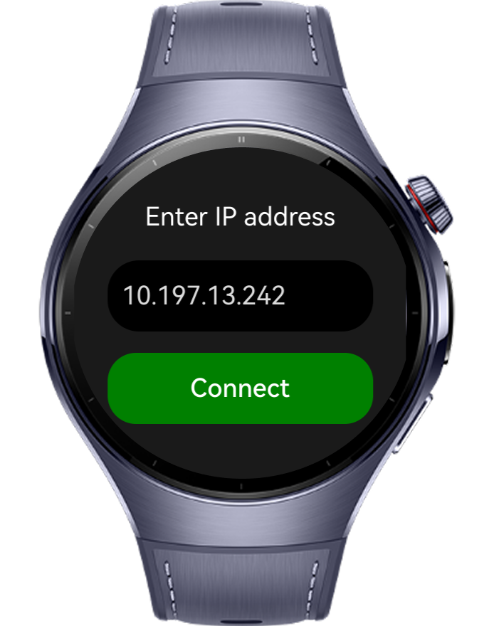
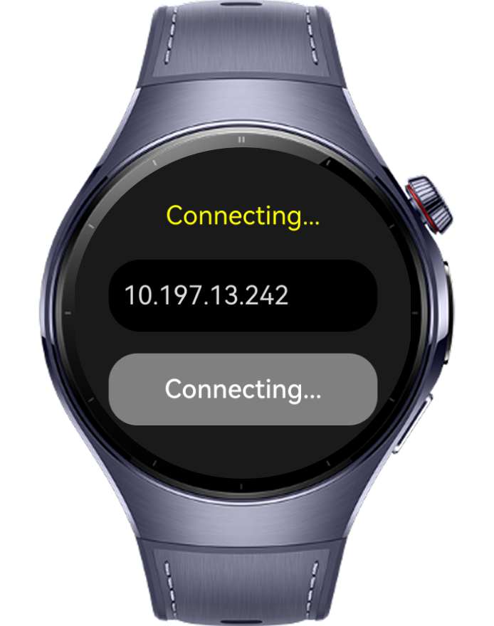
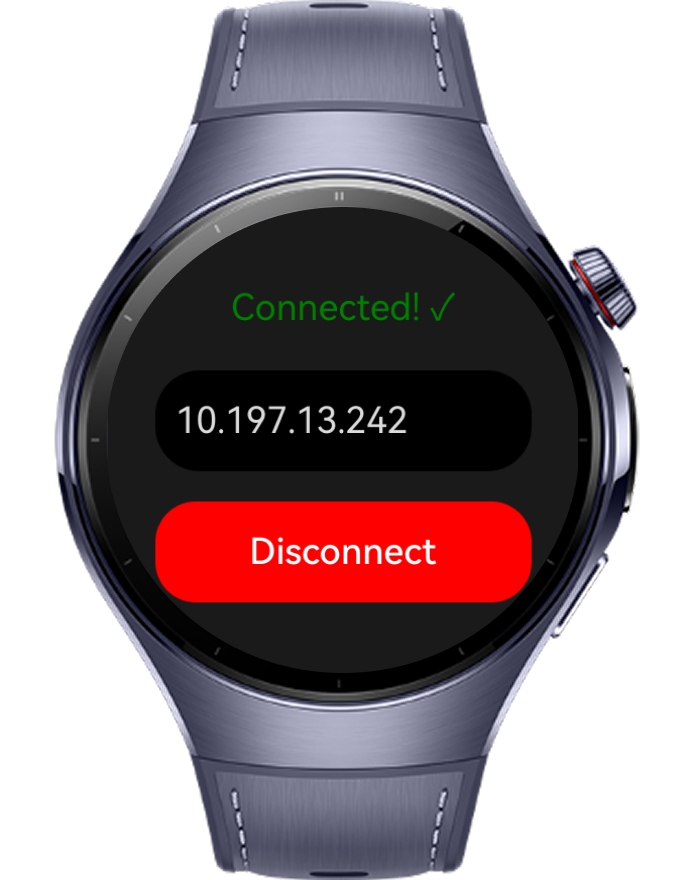

> **Note:** To access all shared projects, get information about environment setup, and view other guides, please visit [Explore-In-HMOS-Wearable Index](https://github.com/Explore-In-HMOS-Wearable/hmos-index).

# How to Implement TCP Connection Functionality

TCP Connection is a codelab project that developed to show how to provide TCP Socket connection with different devices.

# Preview

<div>
  
  
  
  
</div>

# Use Cases

1. Users can enter the IP address of other device which is desired as to be connect device.

# Technology

## Tech Stack

- **Languages**: ArkTS, ArkUI
- **Frameworks**: HarmonyOS 5.1.0(18)
- **Tools**: DevEco Studio Vers 5.1.0.828SP1, HarmonyOS Device Connector (hdc)
- **Libraries**: @kit.ArkUI, @kit.NetworkKit, @kit.BasicServicesKit
- **Networking**: TCP/HTTP socket server on port 12345

## Required Permissions

- `ohos.permission.INTERNET`
  > Required to provide connection over TCP.


# Directory Structure

```
entry/src/main/ets/
├───entryability
│       EntryAbility.ets
├───entrybackupability
│       EntryBackupAbility.ets
├───pages
│       Index.ets
└───
```

# Constraints and Restrictions

## Suported Devices

- Huawei Watch 5

## Limitations

- Air mouse is not working on previewer
- Each devices must be connected in same network

# License

**TCP Connection** is distributed under the terms of the MIT License
See the [LICENSE](/LICENSE) for more information.


